# Active Directory Administration via Remote PowerShell

## Objective
Demonstrate basic Active Directory management directly on Windows Server Core using PowerShell, including OU, user, group, and cleanup tasks.

## Environment

- Server Core IP: `192.168.56.101`
- Active Directory module imported: `Import-Module ActiveDirectory`

## Execution Proof

### Organizational Units (OU)
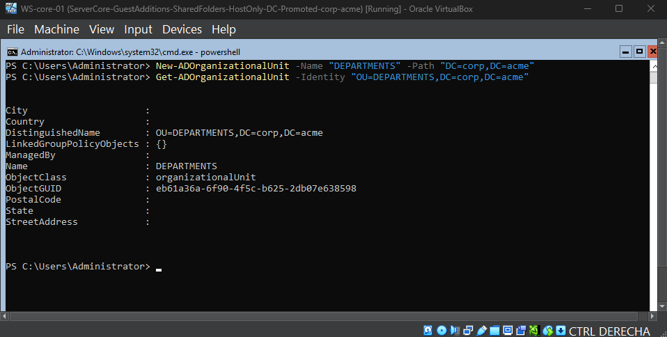  
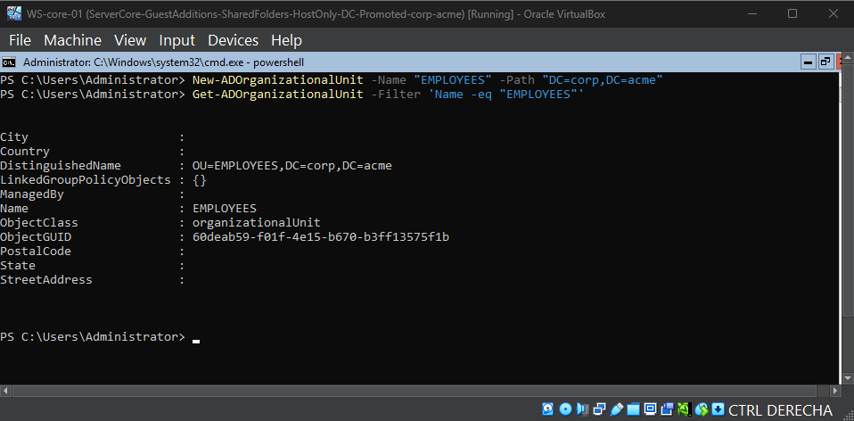  

### User Management
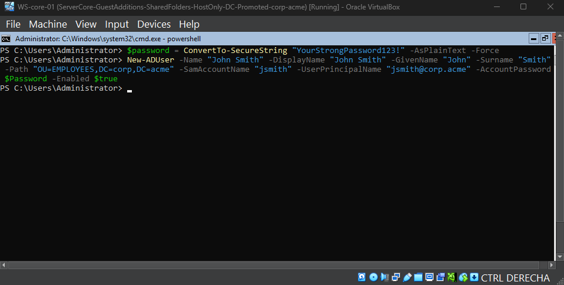
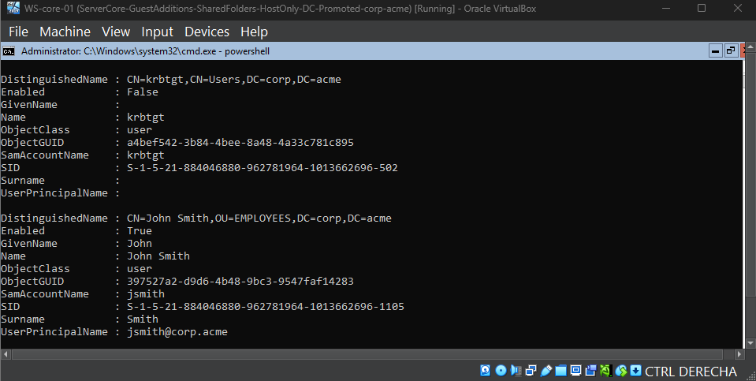  
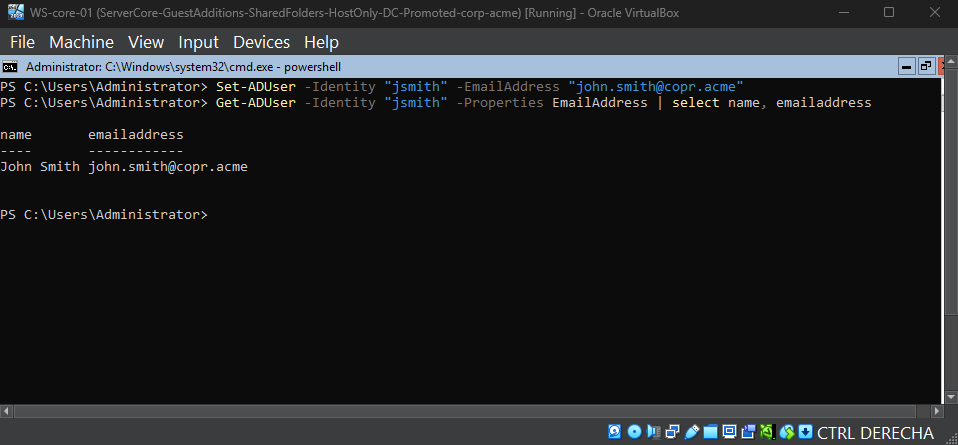  

### Group Management
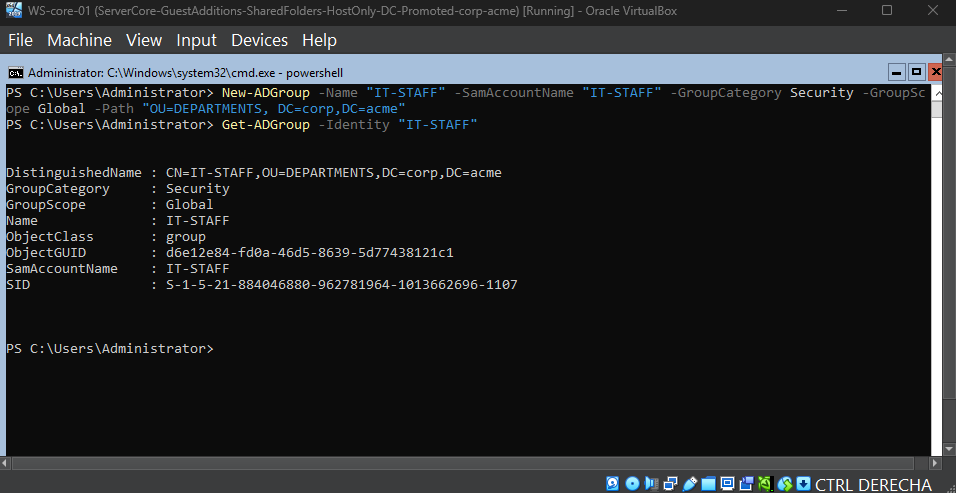
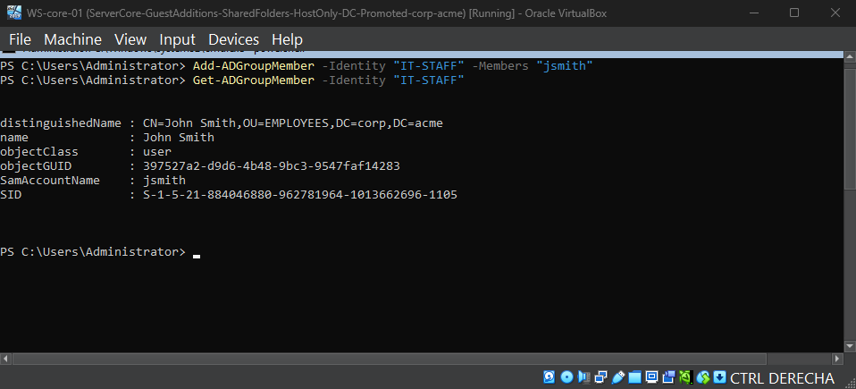
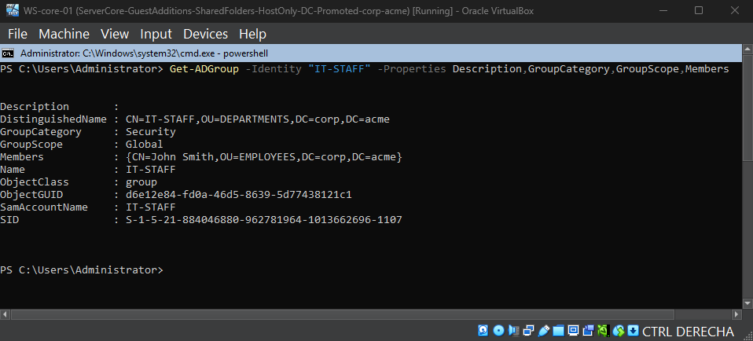  

### Cleanup (User and OU Removal)
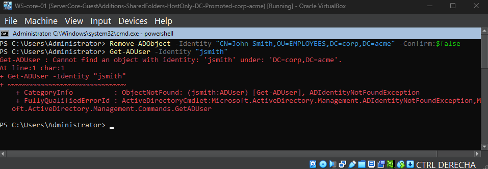
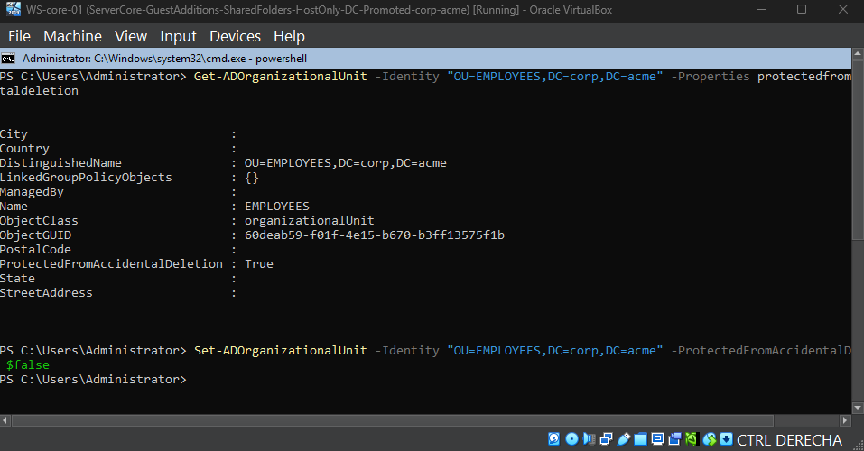 
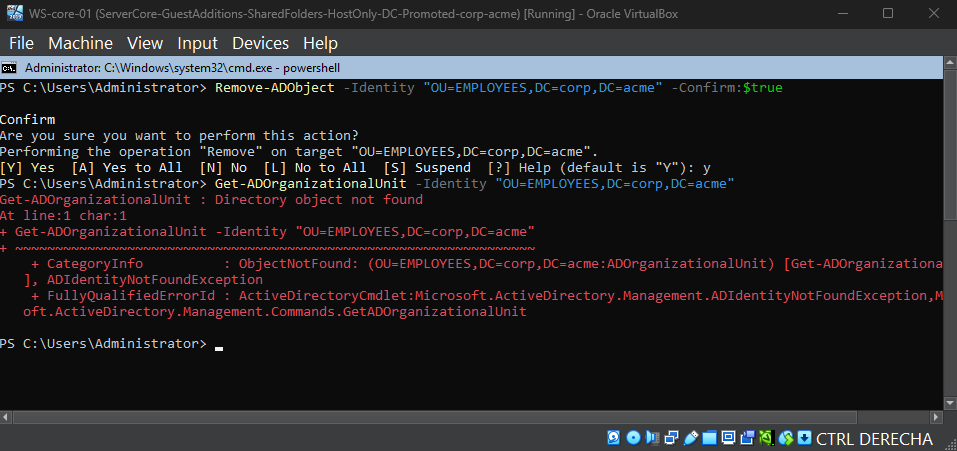 
