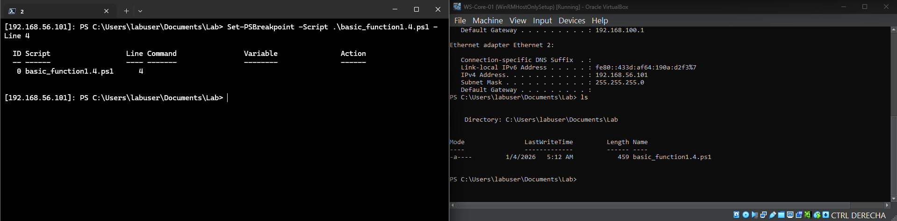
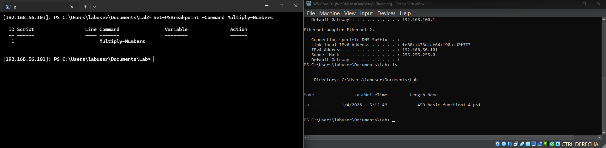
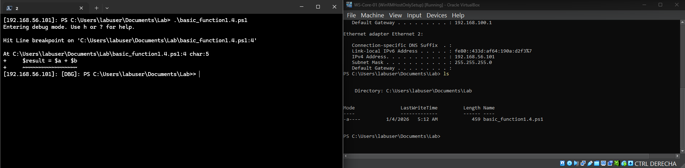
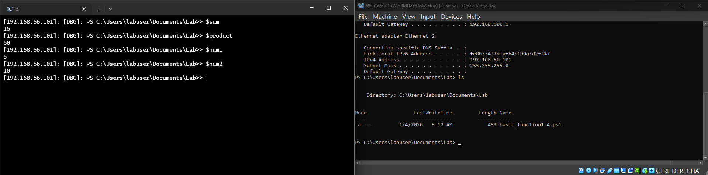
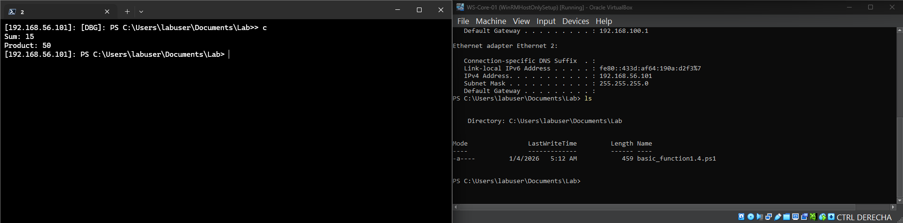

# Debugging-Cmdlets

## Objective
Demonstrates how to debug and analyze PowerShell scripts remotely on a Windows Server using built-in PowerShell cmdlets and breakpoints.

## Steps Performed
1. Connected to the Windows Server.  
2. Navigated to the folder containing the script.  
3. Set breakpoints in the script.  
4. Started the script remotely and used debugger commands.  
5. Observed variable values and output while paused at breakpoints.

## Remote Access Proof

### Breakpoints and Debugger
  
  
  

### Variable Inspection
  

### Script Execution Completed

