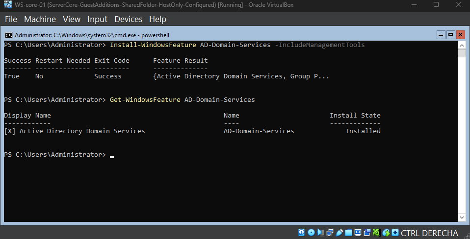
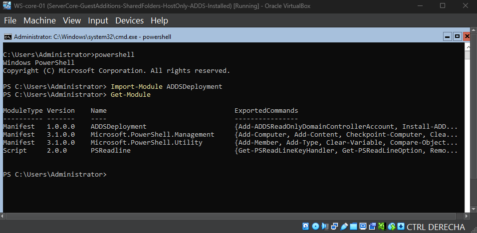
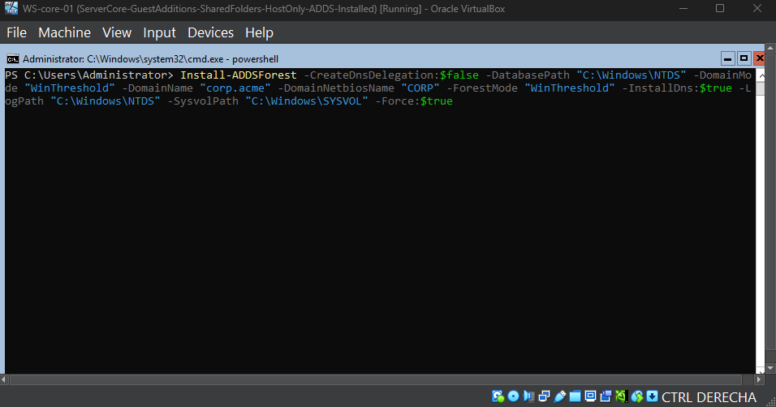
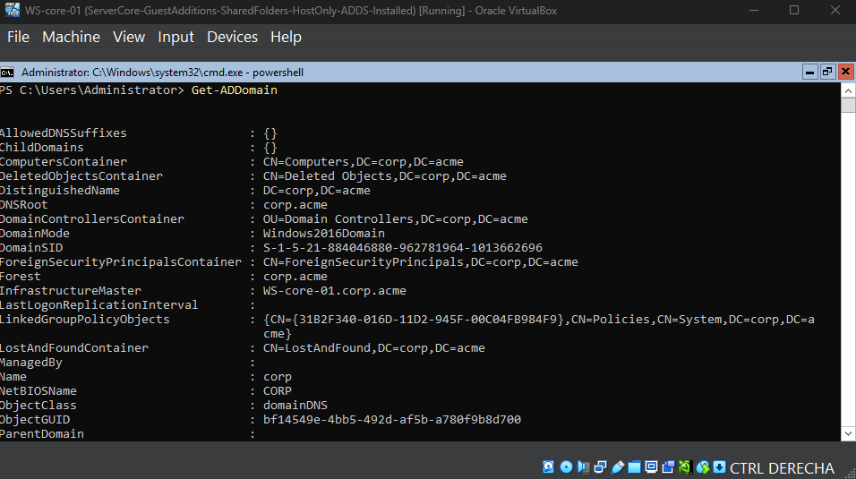
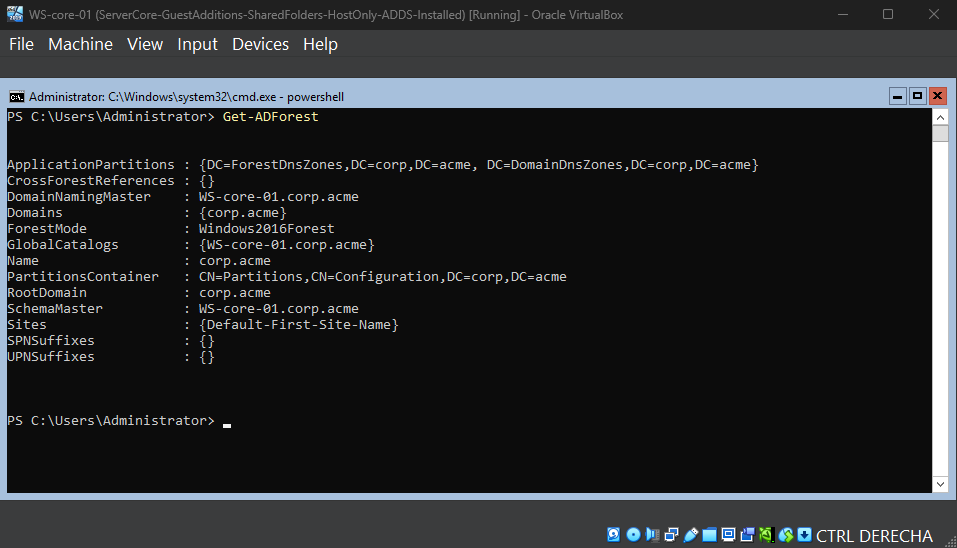
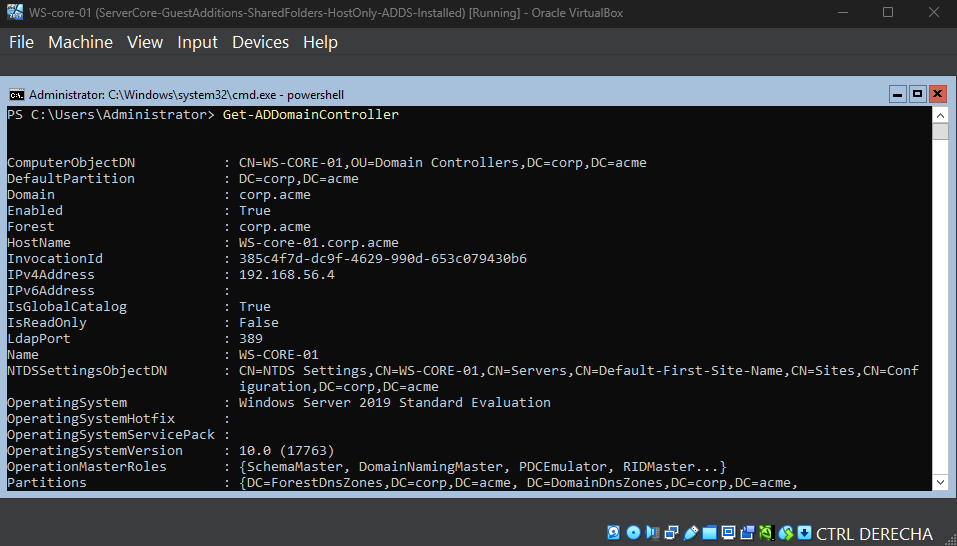

# Domain Controller Setup

## Objective

Demonstrates how to promote a Windows Server to a Domain Controller and create a new Active Directory domain using PowerShell.

## Steps Performed

1. Installed the Active Directory Domain Services (AD DS) role.
2. Installed the required AD DS management tools.
3. Promoted the Windows Server to a Domain Controller.
4. Created the new Active Directory domain and forest.
5. Configured the Domain Controller and DNS during the promotion.
6. Restarted the server after the promotion completed.
7. Verified that the Domain Controller and Active Directory domain were successfully created.

## Domain Configuration

* Domain name: `corp.acme`
* Domain Controller: `DC1.corp.acme`
* Forest root domain: `corp.acme`
* Domain functional level: `Windows Server 2016`
* Forest functional level: `Windows Server 2016`

-  Functional level: Windows Server 2016 — Defines the AD DS features and minimum DC compatibility supported by the domain and forest.

## Execution Proof

### AD DS Installation

### Domain Controller Promotion

### Domain and Forest Verification

### Domain Controller Verification

