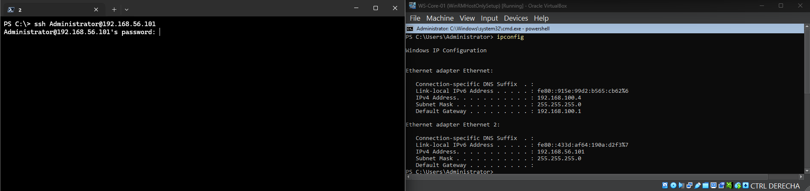
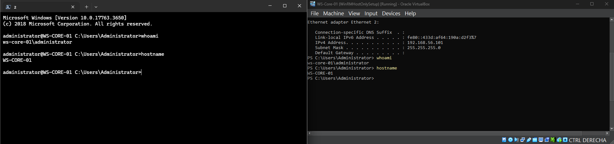

# Remote PowerShell Connection to Windows Server

## Objective
Demonstrates how to establish remote connections to a Windows Server using PowerShell Remoting (WinRM) and SSH.

## Current IP Networks

### NAT Network (VirtualBox)
1. NAT network subnet:    192.168.100.0/24  
2. VM IPv4 static IP:     192.168.100.4  
3. Subnet mask:           255.255.255.0  
4. Gateway:               192.168.100.1  
5. External DNS:          8.8.8.8 / 8.8.4.4  

### Host-Only Ethernet Adapter
- Host IPv4:              192.168.56.1/24  
- Windows Server VM IPv4: 192.168.56.101  

## Steps Performed
1. Enabled PowerShell Remoting using `Enable-PSRemoting -Force` and verified WinRM connectivity.
2. Configured VirtualBox network adapters:
   - Adapter 1: NAT Network (internet access)
   - Adapter 2: Host-Only Adapter (management network)
3. Configured Windows Server network settings:
   - Static IP: 192.168.56.101/24
   - Gateway: 192.168.56.1
   - Primary DNS: 8.8.8.8
   - Secondary DNS: 8.8.4.4
4. Established a remote PowerShell session from the host using:
   - `Enter-PSSession -ComputerName <server>`

## Remote Access Proof

### PowerShell Remoting (WinRM)

### SSH Access

#### Before connection

#### After successful connection

